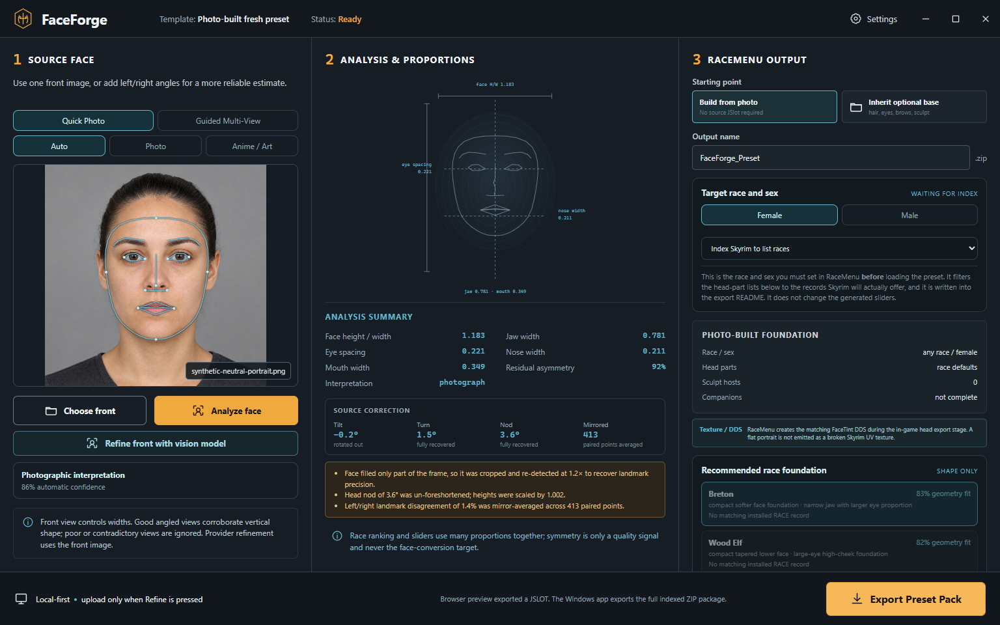

<p align="center">
  
</p>

<h1 align="center">FaceForge</h1>

<p align="center"><strong>Photograph to an editable RaceMenu starting preset.</strong></p>

<p align="center">
  Windows tool that measures a face locally and writes a RaceMenu pack you finish in-game.<br>
  It is <strong>not</strong> a Skyrim plugin, not an SKSE DLL, and <strong>must not</strong> be installed into Skyrim <code>Data</code>, Vortex, or Mod Organizer 2.
</p>

<p align="center">
  <a href="https://github.com/ShugokiFable/FaceForge/actions/workflows/ci.yml"></a>
  <a href="LICENSE"></a>
  <a href="https://github.com/ShugokiFable/FaceForge/releases/tag/v0.24.3"></a>
</p>

<p align="center">
  <a href="https://github.com/ShugokiFable/FaceForge/releases/latest">Download</a>
  ·
  <a href="#quick-start">Quick start</a>
  ·
  <a href="#honest-status">Honest status</a>
  ·
  <a href="CHANGELOG.txt">Changelog</a>
</p>

<p align="center">
  
</p>

<p align="center"><sub>QA render from the 0.24.3 tree, using the bundled synthetic portrait. Not a claim about every photograph.</sub></p>

## Quick start

Latest release: **[v0.24.3](https://github.com/ShugokiFable/FaceForge/releases/tag/v0.24.3)** (`FaceForge-0.24.3-STANDALONE.zip`).

1. Unzip **anywhere on the PC** (Desktop, Documents, a tools folder).
2. Double-click **`FaceForge-0.24.3-STANDALONE.exe`**.
3. **Do not** drop the EXE into `Skyrim Special Edition\Data`.
4. **Do not** add this zip as a Vortex or MO2 mod for Skyrim.

No separate .NET install. Needs **Windows 10/11** and **Microsoft Edge WebView2** (usually already installed).

FaceForge only **reads** your game / Vortex / CharGen folders. It does not change your load order.

Running the EXE **under Mod Organizer 2 / USVFS is not supported**. FaceForge detects that injection and explains it instead of a bare WebView2 failure. Run it directly; it still reads the same mods.

## How to use it

1. Run the EXE. Let it find Skyrim and index your setup (read-only).
2. Add a clear front photo (or multi-view / slow turn video).
3. Analyze → pick race/sex → pick installed head parts (hair, eyes, and so on).
4. Export a **RaceMenu preset pack**.
5. In Skyrim: open RaceMenu → load the preset → sculpt if you want → use **Export Head** (not “slider-only / no sculpt”) if you will build a follower next.
6. Optional: open **[FollowerForge](https://github.com/ShugokiFable/FollowerForge)** and build the NPC plugin from that baked head.

**Pair:** FaceForge (face preset) → RaceMenu bake → FollowerForge (NPC plugin).

## Requirements

**Hard**

- Windows 10/11 + WebView2
- Skyrim Special Edition or Anniversary Edition
- RaceMenu (to load and export the preset in-game)

**Optional**

- High Poly Head and any head-part mods you already use
- Expressive Facegen Morphs — FaceForge writes only the `EFM_` family. Without EFM active, RaceMenu silently ignores those values and the character loads as the race default, identical whatever photo was used
- OpenRouter, or a provider CLI, only if you press vision refine (photos stay local unless you do)
- [FollowerForge](https://github.com/ShugokiFable/FollowerForge) after Export Head

## What this is / is not

| It is | It is not |
| --- | --- |
| An out-of-game Windows utility | A downloadable follower character |
| A photo → RaceMenu preset helper | Something you enable in your load order |
| Safe to keep outside the game folder | A replacement for RaceMenu or Creation Kit |

## Honest status

Verified in this tree:

- `FaceForge 0.24.3/` is the ship snapshot (`CURRENT.txt`)
- 100 frontend tests and 96 native assertions
- TypeScript clean, .NET Release clean, 0 warnings
- Packaged `FaceForge-0.24.3-STANDALONE.exe` (FileVersion 0.24.3.0)
- Rendered-layout check at 1092×614 and 1280×720

Not claimed:

- In-game likeness on an arbitrary photograph
- That the OpenRouter routing fix was re-confirmed against a live key in this environment
- Photograph guidance (still unwritten)
- A closed explanation for one report of a generic in-game result **with EFM present**

`v0.24.2` is withdrawn. Its small-screen CSS change broke panel layout at every window size. 0.24.3 keeps 0.24.2’s other fixes and restores the 0.24.1 shell height. The measurement pipeline is untouched: a 0.24.3 preset is the same as 0.24.1.

## Build from source

Ship tree: `FaceForge 0.24.3\`. Needs Node.js 20+ (pnpm via Corepack is fine) and the .NET 8 SDK.

```powershell
cd "FaceForge 0.24.3"
.\build.ps1
.\package.ps1
```

## Credits

Local face landmarks use MediaPipe Tasks Vision (Apache 2.0). WebView2, React, Vite, and TypeScript are third-party; see [`FaceForge 0.24.3/THIRD_PARTY_NOTICES.md`](FaceForge%200.24.3/THIRD_PARTY_NOTICES.md).

Skyrim, RaceMenu, and related names belong to their owners. This project is unofficial.

## License

[MIT](LICENSE)

## Notes in 0.24.3

Carried from withdrawn 0.24.2:

- OpenRouter 404 on every model — three provider-routing clauses intersected to an empty pool. Only `data_collection: "deny"` is kept
- MO2 / USVFS detection instead of a bare WebView2 crash
- “loaded 4/4” and “missing” at once now reads “present, source mod not identified”
- Warning when Expressive Facegen Morphs is absent

Zip: 119,141,039 bytes. SHA-256: `4B3B01A0D4868D92897E22EABB0057958F1F30D071ADD03A92CFF57D84596F05`.
